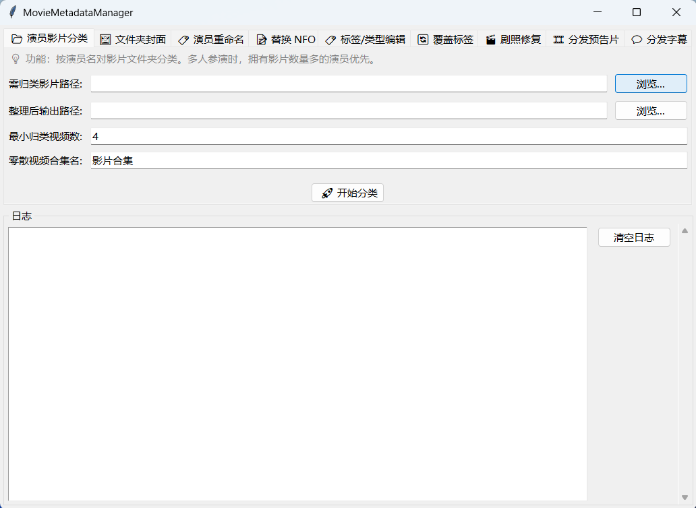

# MovieMetadataManager

## 📖 项目简介

`MovieMetadataManager` 是一个用于批量修改电影刮削资源的工具，旨在帮助用户更高效地整理本地影视库。

### 🖼️ 软件预览

  

### 🌟 核心功能一览

* 📂 **演员影片分类**
* 🖼️ **添加文件夹封面图**
* 🏷️ **演员重命名**
* 📝 **替换 NFO 文件**
* 🏷️ **NFO 标签修改**
* 🎬 **修复剧照预览**
* 💬 **添加字幕与预告片**

---

## ⚙️ 使用说明

> ⚠️ **前提条件**：本软件仅作电影刮削资源的**后续修改**，并不支持资源下载！使用前请确保影片已完成刮削。

### 1. 推荐刮削工具

| 适用类型 | 推荐工具 |
| :--- | :--- |
| **日本/欧美电影** | [MDCx](https://github.com/sqzw-x/mdcx) |
| **动漫/常规电影** | [tinyMediaManager](https://www.tinymediamanager.org/download/) |

### 2. 推荐字幕资源

* 📥 **[字幕包下载](https://www.dropbox.com/scl/fo/t2ornqip90wcaaxlgb1ai/AMxgPxN00ZkrguwaMttTrOQ?rlkey=i01dkl7fvxhpwxv264g3gb365&e=1)** *(更新至 2023 年 3 月)*
* 🐱 **[字幕猫](https://subtitlecat.com)**
* 🌐 **[JAV 字幕网](https://javzimu.com)**
